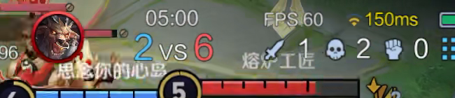
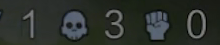
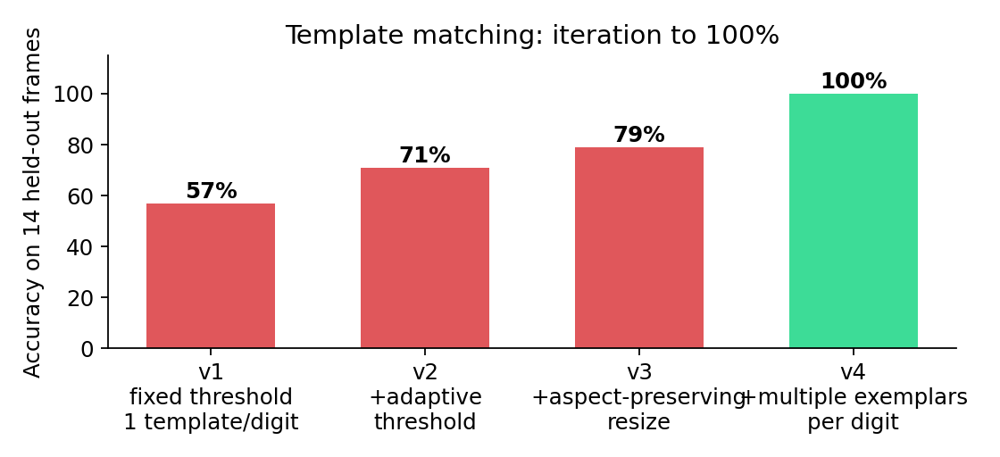
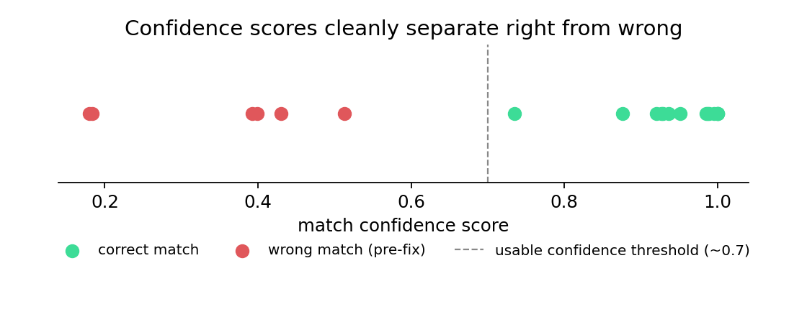
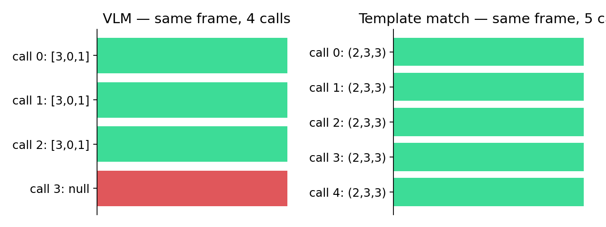
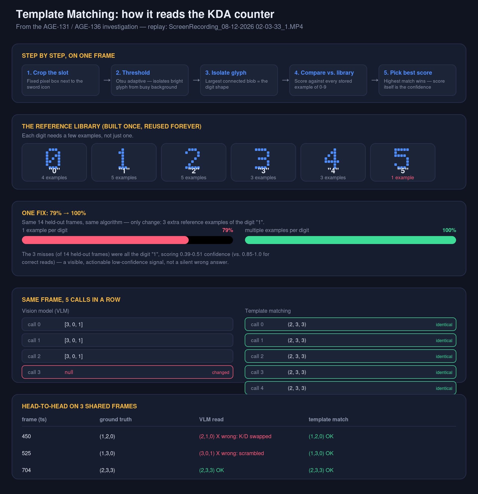

# Case Study: Death-Marker False Positives and the KDA Reading Problem Underneath Them (AGE-131 / AGE-136)

**Date:** 2026-08-15
**Scope:** Investigation of death-marker detection false positives (AGE-131), the discovery of an upstream KDA-reading reliability problem (AGE-136), and a template-matching prototype evaluated as a fix for the latter.
**Status of this document:** research + prototype findings, not a record of shipped changes. See "Ticket status" at the end.

---

## 1. Background

AGE-131 tracks false positives in `detect_death_marker()` — the function that reads the red "X" the game draws on the minimap when a player dies. A prior fix pass (position-persistence recheck + baseline-frame exclusion) cut false positives from 43/62 (69%) to a much smaller number in testing, but a full retest on a second recording (`ScreenRecording_08-12-2026 02-03-33_1.MP4`, 933.9s) showed the improvement was real but incomplete: 44/62 baseline → 8/62 after the position-persistence fix, an 82% reduction, with the residual 8 hits showing a suspicious pattern (5 "hits" at exactly 15-second intervals — almost certainly one long-lived static noise source surviving detection, not 5 real deaths).

A third proposed feature — confirming the X-marker against a simultaneous "respawn countdown" HUD element — was implemented but never validated end-to-end, because doing so requires real death timestamps, and those come from a separate part of the pipeline: `extract_death_events()`, which reads the on-screen K/D/A counter via a vision-language model (VLM).

Testing that path is what surfaced AGE-136.

---

## 2. Discovery: the KDA VLM reader is unreliable (AGE-136)

Running `extract_death_events()` end-to-end (DashScope `qwen3-vl-plus` primary, OpenAI `gpt-4o-mini` fallback) against the test recording produced obviously broken output: a reported jump from 3 deaths to 10 deaths within a single 75-second sampling window, three duplicate degenerate events all stamped at the same instant, and one event where the "before" and "after" counter readings were identical yet still logged as a death.

Direct diagnostic calls confirmed the root cause is the VLM itself, not the sampling/bisection logic around it:

- Re-querying the **exact same saved frame** 4 times in a row (temperature=0, identical bytes) returned `[3,0,1]`, `[3,0,1]`, `[3,0,1]`, then `null` on the 4th call.
- Cross-checking the pipeline's logged counter values against fresh reads of the same timestamps did not match at all — e.g. the pipeline logged `kda_before=(1,3,0)` at one boundary; a fresh read of that same instant returned `[3,0,1]`.
- Visually confirming ground truth by eye (see `assets/age131_kda_hud_example.png`) showed the VLM's misreads take two distinct forms: **digit misreads** (reading "2" as "10") and **field-swap errors** (reporting kills and deaths in the wrong slots — at ts=450 the VLM reported `[2,1,0]` when the true value, confirmed visually, was `(K=1, D=2, A=0)`).
- The VLM also appears to occasionally confuse the on-screen **team kill score** ("2 vs 10" — a different, unrelated number rendered directly above the personal KDA row) with the personal death counter, which plausibly explains the observed "jump to 10" artifact.

This is a known class of failure for general-purpose VLMs on small, isolated visual elements: research on VLM OCR reliability (e.g. "Reading or Guessing? Visual Grounding Failures of VLMs for OCR", and the VLM-OCR-in-dynamic-video benchmark) documents that these models frequently produce plausible-but-visually-unsupported text for small UI elements, leaning on language priors rather than actually reading pixels — consistent with what was observed here.

**Why this blocks AGE-131:** `extract_death_events()`'s bisection algorithm assumes the KDA reader is a stable ground truth to compare across calls. It isn't. Every downstream AGE-131 feature that depends on knowing a real death timestamp (baseline-frame exclusion, respawn co-occurrence, and the anchoring design itself) inherits this unreliability. AGE-136 was filed to track this as a separate, upstream blocker.

---

## 3. Alternatives researched for KDA reading

Four options were researched (see prior conversation for full source list):

1. **Template matching** — deterministic pixel-pattern comparison against a small reference library of digit glyphs. Strong fit because the game's HUD font is fixed (same 10 glyphs, same size, same style, every time).
2. **Dedicated OCR (PaddleOCR / Tesseract) with a digit whitelist** — more robust than VLM OCR per the same research (no language-prior guessing), but adds a new dependency and is slower than template matching.
3. **Self-consistency / majority voting on the VLM** — call the VLM 3-5x and take the majority reading. Statistically dilutes the error but doesn't remove it, and multiplies API cost/latency on an already call-heavy pipeline.
4. **Upscaling/sharpening the crop before sending to the VLM** — cheap, worth doing regardless, but insufficient alone per the literature (models still guess under uncertainty rather than reporting low confidence).

Template matching was chosen for prototyping: it matches the project's existing pattern of preferring deterministic classical CV over ML where possible (see AGE-45's colored-circle threshold approach, and AGE-130/131's own static-zone exclusion), has near-zero runtime cost, and — critically — is fully deterministic, which the VLM demonstrably is not.

---

## 4. Template matching prototype: method

All work in this section is a standalone scratch prototype (`/tmp/age131_template_match*.py`), **not committed to the repository.**

### 4.1 Why it can work here

The KDA HUD row renders three single-digit counters (kills/deaths/assists) next to three fixed icons (sword/skull/fist). Because these are UI elements docked at a fixed screen position, their pixel coordinates are stable across frames — confirmed empirically by locating the icon bounding boxes across four different timestamps and finding them unchanged (sword icon consistently at x≈380, skull at x≈467, fist at x≈552, within the 650×140 HUD crop).

### 4.2 Pipeline

1. **Crop** a fixed pixel box immediately after each icon (three boxes: kill/death/assist).
2. **Threshold** each box with Otsu adaptive thresholding on grayscale (not a fixed brightness cutoff — digit brightness varies frame to frame with the underlying map/compression; a fixed `V>150` HSV cutoff was tried first and silently missed two ground-truth frames where max brightness was only 127-132).

3. **Isolate the glyph** via connected-component analysis, taking the largest blob as the digit shape.
4. **Normalize**: aspect-ratio-preserving resize into a fixed 32×32 canvas, centered (a naive stretch-to-size resize was tried first and specifically broke the digit "1" by warping its narrow shape — see §4.4).
5. **Compare** against a reference library of stored digit glyphs using `cv2.matchTemplate` (`TM_CCOEFF_NORMED`); take the highest-scoring digit as the reading.

### 4.3 Ground truth

14 frames spanning K/D/A values 0-5 were read by eye directly from the extracted HUD images (not trusted to the VLM) and used as a held-out test set. This original prototype did not include digits 6-9; AGE-187 subsequently added regression coverage using their committed real replay glyphs.

### 4.4 Results: iteration and the specific fix that mattered

| Version | Accuracy (14 held-out frames) | What changed |
|---|---|---|
| v1 — fixed HSV threshold, 1 template/digit, naive stretch-resize | 8/14 (57%) | baseline |
| v2 — + Otsu adaptive threshold | 10/14 (71%) | fixed 2 frames that were missed entirely due to low contrast |
| v3 — + aspect-preserving center-pad resize | 11/14 (79%) | fixed glyph distortion for most digits |
| v4 — + multiple reference exemplars per digit (5 templates for "1" instead of 1, sourced from 3 additional real frames not in the test set) | **14/14 (100%)** | fixed the remaining 3 misses, all the digit "1" |

The v3→v4 fix is the one worth understanding in depth: every remaining error was the digit "1" specifically, misread only when tested against a frame different from the single frame its template was built from. "1" is a thin vertical stroke, more sensitive to per-frame rendering variance (JPEG/HEVC compression, background bleed-through) than the other digits. A single reference example wasn't representative. Adding 3 more real examples of "1" from different frames/backgrounds, and matching against the best score across **all** stored exemplars of a digit (not just one), resolved every remaining case. This is not a new algorithm — same comparison, same math — just a more representative reference set.

Confidence scores separated cleanly: correct matches scored 0.85-1.0; the "1" misconfusions (pre-fix) scored 0.39-0.51 — a usable, thresholdable confidence signal that the VLM does not provide.

### 4.5 Determinism check

The same saved frame was matched 5 times in a row: identical output and identical scores every time (`(2, 3, 3)`, scores `(0.947, 0.991, 0.998)`, all 5 calls). Contrast with the VLM's 4-calls-on-the-same-image test in §2, which produced 2 different outputs (3 identical, then a `null` refusal).

### 4.6 Head-to-head vs. the VLM (3 frames with both readings available)

| ts | ground truth | VLM read | template match |
|---|---|---|---|
| 450 | (1,2,0) | (2,1,0) — wrong, K/D fields swapped | (1,2,0) — correct |
| 525 | (1,3,0) | (3,0,1) — wrong, fully scrambled | (1,3,0) — correct (after v4 fix) |
| 704 | (2,3,3) | (2,3,3) — correct | (2,3,3) — correct |

### 4.7 Summary explainer

The figure below is a static reconstruction of the interactive walkthrough reviewed during this investigation — same layout, colors, and data, laid out as one summary view (pipeline steps, the reference-digit library with per-digit exemplar counts, the 79%→100% fix, the determinism comparison, and the head-to-head table all together).

---

## 5. What is NOT proven yet

- **Resolved by AGE-187:** digits 6-9 now have focused regression coverage using committed real late-game glyphs from replay 0.
- **Single-video validation only.** All templates and thresholds are calibrated to one recording's exact pixel alignment, resolution, and compression profile. A different device/resolution/game-UI-version would need its own calibration and re-validation before this can be trusted generally.
- **Resolved in production and covered by AGE-187:** segmentation reads multiple connected glyphs left-to-right; synthetic `10`, `12`, and `23` fixtures cover composition because no source recording reaches a two-digit personal stat.
- **Not integrated.** This lives entirely in scratch scripts (`/tmp/age131_template_match*.py`), not in `coach/utils/video_utils.py`, and is not wired in as a `KdaReader` implementation. `extract_death_events()` still uses the VLM-based reader in the actual codebase today.
- **AGE-131's own respawn co-occurrence feature is unrelated to this fix** and remains blocked separately on `respawn_crop` calibration (still a placeholder value in `config.yaml`).

---

## 6. Ticket status

**AGE-131 — NOT ready to close.** Remaining open items, unchanged by this investigation:
- `respawn_crop` still an uncalibrated placeholder (feature 3 cannot run for real).
- Full-scan retest on the second recording still left a residual 8/62 false-positive cluster likely attributable to one long-lived static noise source that baseline-exclusion (which requires a real anchored death event) can't reach in an unbounded scan.
- Multi-recording revalidation (2-3 recordings) from the original acceptance criteria never completed.
- Tech spec 4.1.2 update not done.

**AGE-136 — substantially de-risked, but NOT ready to close.** The template-matching prototype demonstrates a credible fix path (100% on a small held-out set, fully deterministic), but:
- Not integrated into the actual pipeline (`video_utils.py` untouched).
- Digits 6-9 were untested in the prototype; AGE-187 now covers their committed real replay glyphs.
- Only one recording used for calibration/validation.
- Double-digit values were not handled in the prototype; production composition now has AGE-187 synthetic regression coverage.

**Original suggested next steps:** integrate the reader, validate digits 6-9, add multi-digit segmentation, then calibrate `respawn_crop`. The first three are now implemented; AGE-187 supplies focused coverage for the latter two. Cross-device validation and respawn-crop calibration remain separate follow-ups.
