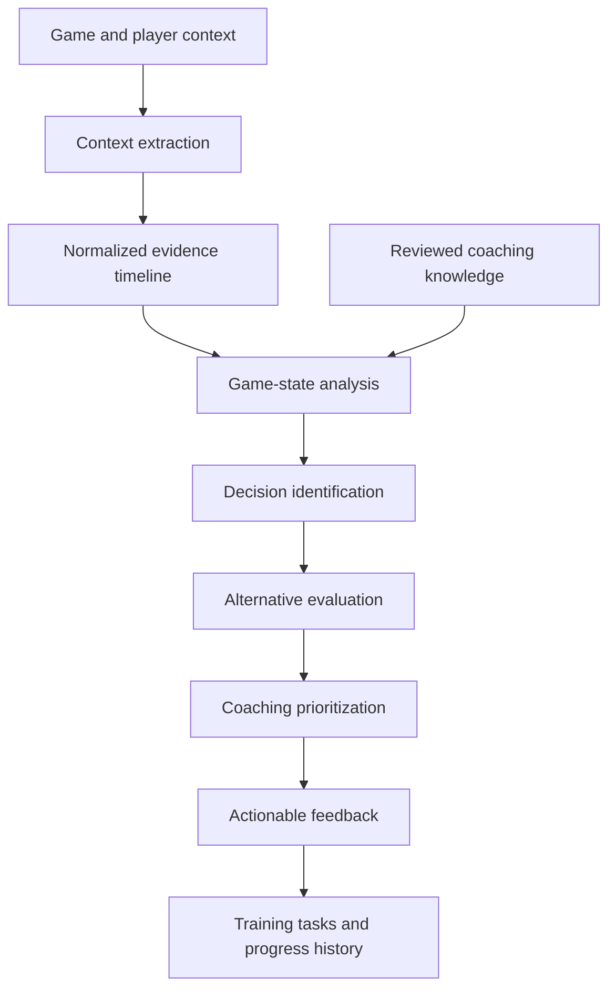

# Honor of Kings AI Coach

An AI-powered coaching system for **Honor of Kings (王者荣耀)** that analyzes gameplay context and provides actionable, personalized coaching.

The goal is not to build another generic game chatbot. HokCoach is designed to help players understand **what they should have done differently, why it mattered, and what to do next time**.

## What It Does

The coach is designed to:

- Analyze gameplay and game-state information.
- Identify important decisions, mistakes, and opportunities.
- Reason about *why* a decision was suboptimal.
- Prioritize the highest-impact coaching opportunities.
- Provide specific, actionable recommendations.
- Adapt advice to the player's situation rather than relying only on generic game rules.

HokCoach explores how an AI system can do this from incomplete multimodal evidence—video, HUD state, game audio, and player context—without presenting guesses as facts.

## Demo

This repository currently provides a local CLI, FastAPI backend, and browser-based interface prototype. There is no hosted public demo yet.

- [Open the interface prototype](coach_prototype.html) after starting the local API.
- Or run a replay directly from the CLI:

```bash
cd coach
python coach.py --replay /path/to/replay.mp4
```

Automatic video results depend on the recording layout and calibrated extractors. Unsupported evidence is reported as unavailable rather than inferred.

## Quick Start

### Prerequisites

- Python 3.10+
- `ffmpeg` and `ffprobe` for replay processing
- A modern browser for the interface prototype
- Optional LLM/VLM API credentials for generated feedback and visual-model fallback

On macOS, install FFmpeg with:

```bash
brew install ffmpeg
```

### Installation

```bash
git clone https://github.com/graceyunliu/hokcoach.git
cd hokcoach/coach
python3 -m venv .venv
source .venv/bin/activate
pip install -r requirements.txt
```

The core manual and rule-based workflows can run without optional model credentials.

### Environment variables

Set only the providers you intend to use. Configuration lives in `coach/config/config.yaml`.

```bash
export COACH_LLM_API_KEY="..."   # AI feedback and chat
export COACH_VLM_API_KEY="..."   # replay-frame interpretation
export OPENAI_API_KEY="..."      # optional configured vision fallback
```

Do not commit API keys. When a provider is unavailable, HokCoach uses its documented degraded mode or abstains.

### Run the CLI

```bash
cd coach

python coach.py --init                    # create a player profile
python coach.py --replay --manual         # review a match manually
python coach.py --replay replay.mp4       # analyze a replay video
python coach.py --checkin --rate 90       # record training completion
python coach.py --weekly-report           # generate the weekly review
python coach.py --progress --chart        # inspect progress
python coach.py --chat                    # open coaching chat
```

### Run the local interface

Start the API:

```bash
cd coach
uvicorn api.main:app --reload
```

Verify it at [http://localhost:8000/health](http://localhost:8000/health), then open `coach_prototype.html` from the repository root in a browser. The prototype connects to the API on port 8000.

## How It Works



### Replay evidence workflow

1. **Acquire evidence.** The replay pipeline reads supported HUD regions, death/KDA changes, minimap signals, and game audio. Manual replay input remains available when extraction is unsupported.
2. **Normalize observations.** Each signal records its source, timestamp, detector version, confidence, and evidence state.
3. **Build a match timeline.** Independent observations are ordered without discarding conflicting evidence.
4. **Analyze decisions.** Detector and reasoning stages identify supported decisions, mistakes, and opportunities across lifecycle, objectives, economy, waves, teamfights, and cooldown readiness.
5. **Evaluate alternatives.** The coach considers what information and options were available, then compares plausible alternatives without inventing missing state.
6. **Prioritize coaching.** The replay engine combines supported match evidence with the player's profile and reviewed coaching principles to select the highest-impact lesson.
7. **Close the loop.** Feedback becomes a concrete next action, training task, check-in, weekly review, and progress history.

The key state distinction is intentional:

- `observed`: the detector has supporting evidence;
- `unknown`: evidence is missing or insufficient;
- `unreadable`: the expected signal could not be decoded.

Missing evidence is never silently converted into “nothing happened.”

## Project Structure

```text
coach/
  coach.py                 CLI entry point
  api/                     FastAPI backend
  core/                    orchestration, replay reasoning, timeline, detectors
  adapters/                manual and media input adapters
  tools/                   extraction, calibration, annotation, evaluation CLIs
  tests/                   offline regression suite
  config/config.yaml       providers, feature flags, layouts, thresholds
  knowledge_base/          reviewed coaching principles
coach_prototype.html       local browser interface
data/evaluation/           compact labels, manifests, and evaluation reports
tools/                     corpus and experimental detector workflows
docs/                      architecture and operator documentation
```

Large replay media, generated labeling clips, caches, and API secrets are intentionally kept out of Git.

## Evaluation and Testing

Run the offline application and detector regression suite:

```bash
cd coach
python3 -m unittest discover -s tests -p 'test_*.py'
```

Validate the stable replay corpus from the repository root:

```bash
python3 tools/validate_stable_corpus.py
```

### Current detector status

A detector stage existing in code does **not** mean that its raw-video recognizer is calibrated or enabled for every layout.

| Capability | Current status |
|---|---|
| KDA and death-centered analysis | Implemented for calibrated layouts |
| Game-voice event timeline | Implemented as conservative supporting evidence |
| Kill-announcement audio baseline | Evaluated experimental baseline; not production-enabled |
| Kill-feed visual confirmation | Human-labeled fusion evaluation complete; automatic recognizer pending |
| Objective outcomes | End-to-end scaffold; disabled pending direct held-out labels |
| Cooldown readiness | Opt-in pilot calibration; incompatible layouts abstain |
| Towers, recall, items/economy, waves, teamfight participation | Fusion/state stages exist; raw-video recognition remains calibration-dependent |

### Kill-event evaluation example

The committed stress evaluation shows why the system uses multimodal confirmation:

- The audio baseline achieved **70% precision** and **87.5% recall** on its labeled stress split.
- Human-reviewed kill-feed decisions removed all three audio false positives in that split.
- Automatic kill-feed recognition is not implemented yet, so this supports the fusion design rather than claiming production accuracy.

Compact labels and reports are stored under `data/evaluation/operator_labeling/`. Reviewer speech, transcripts, and corpus hints may locate candidate windows, but they are not treated as visual ground truth.

## Product and AI Design

### Why I built this

I wanted to explore what an AI coach could look like when it is grounded in the actual decision-making context of a game rather than simply answering questions about game mechanics.

Traditional game guides tell you what is generally optimal:

> “Build this item.”
>
> “Rotate at this time.”
>
> “Don't overextend.”

But real gameplay is contextual. The right decision depends on the game state, the player's role, teammates, opponents, timing, resources, and what happened previously.

That makes coaching an interesting agent problem: **the AI needs to reason about context, identify the most important mistake or opportunity, and translate that reasoning into advice a player can actually apply.**

### Product approach: coach the decision

The core product principle is:

> **Coach the decision, not just the outcome.**

A player does not necessarily improve by being told that a play was “wrong.” They improve by understanding:

1. What happened?
2. What information was available at the time?
3. What options did the player have?
4. Which decision had the higher probability of success?
5. Why?
6. What should the player recognize next time?

This creates a coaching loop rather than simply generating commentary.

### Project goals

- Reconstruct enough game context to evaluate decisions rather than only outcomes.
- Turn evidence into prioritized coaching instead of an exhaustive event summary.
- Personalize recommendations to the player's role, goals, constraints, and recurring patterns.
- Make every important coaching claim traceable to evidence and explicit uncertainty.
- Convert each review into a behavior the player can recognize and practice in the next match.
- Measure detector quality and abstain when the recording cannot support a reliable conclusion.

### Why this is an AI coaching problem

Most game assistants answer mechanics questions or summarize statistics. HokCoach is designed around a different question: can software reconstruct enough match context to explain **why a decision succeeded or failed**, then turn that explanation into the next practice task?

The coaching layer therefore considers the player's goals, recurring weaknesses, available match evidence, and training history—not just isolated events.

### The hardest problem

The main challenge is not generating fluent advice. It is establishing what actually happened in recordings with different resolutions, cropped gameplay viewports, reviewer overlays, incomplete HUD visibility, and overlapping game audio.

HokCoach addresses this by making provenance and abstention part of the architecture. Recognizers are versioned by layout and calibration inputs; unsupported layouts abstain; derived events retain their atomic dependencies; and tuning events are kept separate from held-out evaluation events.

### Design decisions

- **Evidence before language.** Coaching claims must trace back to observations.
- **Deterministic first.** KDA templates, timestamps, configuration, and fusion rules are preferred where they are measurable and reproducible.
- **Models are optional components.** LLM/VLM failures should degrade a capability, not invalidate the entire application.
- **Calibration is capability-specific.** A working detector on one HUD layout is not assumed to generalize to another.
- **Compact, reproducible evaluation.** Git stores hashes, labels, manifests, and reports—not large source recordings or regenerable caches.

### What this project has demonstrated

- A coaching product needs an evidence-quality model, not only a prompting strategy.
- Audio is useful for finding candidate events but needs visual or state corroboration for reliable semantics.
- More replay hours do not automatically improve a detector; directly labeled target events do.
- Honest abstention is a product behavior: it prevents unsupported feedback from eroding user trust.

## Roadmap

- Implement and evaluate automatic kill-feed visual confirmation.
- Expand direct labels for recall, objectives, towers, economy/items, waves, and teamfight participation.
- Calibrate additional raw-gameplay HUD layouts with purpose-recorded footage.
- Report held-out, multi-video precision, recall, coverage, abstention correctness, runtime, and storage costs per capability.
- Package the local interface into a simpler end-user replay-upload workflow.

## Documentation

- [Coach application guide](coach/README.md)
- [Production detector architecture](docs/production_detector_architecture.md)
- [Replay corpus system design](seed_corpus_system_design.md)

HokCoach is under active development. Metrics are pilot or stress-set results unless explicitly identified as held-out, multi-video evaluation.
