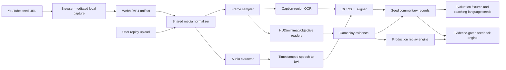

# HokCoach 100-Seed Replay Corpus Processing System Design

**Status:** Proposed implementation design  
**Version:** 1.0  
**Scope:** Seed-video acquisition, burned-in caption extraction, speech-to-text reconstruction, evaluation-label generation, and integration boundaries with the production replay pipeline.

## 1. Purpose

The purpose of this system is to finish the 100-video replay-review seed corpus and extract the reviewer behaviors that hokcoach should eventually reproduce. The corpus is not a user-facing feature by itself. It is an evaluation and model-development asset used to learn what strong replay reviewers notice, how they phrase feedback, which gameplay evidence supports their claims, and how precisely their commentary maps to game time.

The system must preserve a strict distinction between **observable evidence**, **reviewer commentary**, and **AI-generated interpretation**. A burned-in caption is evidence of what the editor displayed. Speech-to-text is evidence of what the reviewer said. A gameplay detector is evidence of what the game state appears to contain. A canonical coaching card is a derived interpretation and must never overwrite the raw sources.

## 2. Design principles

| Principle | Requirement |
|---|---|
| Evidence first | Preserve raw frames, OCR text, speech text, timestamps, confidence, and provenance before normalization. |
| Shared perception core | Seed processing and user replay processing reuse frame, OCR, HUD, minimap, and evidence schemas. |
| Separate orchestration | Browser capture, YouTube access, channel metadata, and corpus labeling remain seed-only. |
| Abstention | If OCR, speech, or gameplay evidence is insufficient, emit an explicit uncertainty state rather than an invented claim. |
| Reproducibility | Every derived artifact records source hash, tool version, configuration, and timestamp clock. |
| Typed rank semantics | `regular_rank`, `peak_score`, and `hero_power` are independent fields and must never be conflated. |
| Precision before recall | A missed coaching seed is preferable to a confidently incorrect coaching judgment. |
| Resumability | Every stage is restartable per video and never requires restarting the whole 100-video batch. |

## 3. System boundary

The seed pipeline begins with a YouTube replay-review URL and ends with aligned commentary records and evaluation fixtures. The production user pipeline begins with a local user-uploaded replay and ends with evidence-gated coaching feedback. Both converge only at the normalized evidence and feedback interfaces.



## 4. Current hokcoach components and reuse plan

The current repository already contains useful primitives, but the existing screenshot OCR adapter is not the same thing as a deterministic burned-caption OCR engine.

| Component | Current responsibility | Seed-corpus use | User-replay use |
|---|---|---|---|
| `coach/utils/video_utils.py` | `ffmpeg`-based frame/audio operations and OpenCV HUD/minimap processing | Reuse directly; add caption-region sampling entry points | Reuse directly |
| `coach/adapters/ocr_adapter.py` | Screenshot-to-structured-data adapter backed by a vision model | Use as fallback for difficult frames or validation samples | Keep as existing screenshot fallback |
| PaddleOCR, if present in another local branch | Local image OCR | Prefer as deterministic caption OCR backend | Optional runtime backend |
| `coach/core/replay_engine.py` | Replay event assembly and analysis | Consume normalized seed evidence only when generating fixtures | Main user replay path |
| `coach/core/feedback_engine.py` | Evidence-gated coaching cards | Convert accepted seed records into training/evaluation targets | Generate user-facing feedback |
| `tools/browser_capture_replays.js` | Browser-mediated media capture from a logged-in Chrome profile | Seed-only acquisition | Must not run for user uploads |
| `tools/merge_windowed_captions.py` | Merges windowed multimodal caption tables | Bootstrap silver labels when deterministic media is unavailable | Not used |

The recommended implementation is **shared-core/separate-orchestration**. Do not embed YouTube or browser logic into `replay_engine`, and do not make the production app depend on seed-corpus metadata.

## 5. Input acquisition

### 5.1 Seed videos

The preferred seed path is:

```text
YouTube URL
→ authenticated local browser capture or local download
→ WebM/MP4 with preserved presentation timestamps
→ local processing
```

The browser is used only to obtain the media. It is not responsible for OCR. A separate Chrome profile launched with remote debugging is preferred so the user can sign in without exporting passwords or cookies. The capture worker must record:

```json
{
  "video_id": "TcPNUG4b6GE",
  "source_url": "https://www.youtube.com/watch?v=TcPNUG4b6GE",
  "capture_method": "browser_mediarecorder",
  "capture_started_at": "2026-08-27T00:00:00Z",
  "source_duration_sec": 481,
  "artifact_path": "TcPNUG4b6GE.webm",
  "artifact_sha256": "...",
  "status": "captured|failed|skipped"
}
```

If browser capture is unavailable, windowed multimodal analysis may produce silver labels, but those labels must be marked `silver_multimodal` and must not be presented as deterministic OCR ground truth.

### 5.2 User replays

User replays enter as local files through the existing upload/CLI/API path. They bypass browser capture, source-channel metadata, rank enrichment, and seed labeling. They use the same media normalizer and evidence schemas after ingestion.

## 6. Media normalization

Every media artifact should be normalized before frame or audio processing:

```bash
ffprobe -v error -show_streams -show_format -of json input.webm
ffmpeg -i input.webm -map 0:v:0 -c:v libx264 -pix_fmt yuv420p normalized.mp4
ffmpeg -i input.webm -map 0:a:0? -ac 1 -ar 16000 audio.wav
```

The implementation should not transcode unnecessarily if the WebM is already decodable. It should retain the original artifact and record any normalized derivative. All timestamps are measured against the original media presentation clock.

Required validation fields include duration, FPS, resolution, video codec, audio codec, audio sample rate, stream start time, and whether audio/video durations differ by more than 250 ms.

## 7. Frame sampling and caption OCR

### 7.1 Sampling strategy

The first pass samples one frame per second. Caption transitions detected by OCR instability or large caption-region pixel changes trigger an optional refinement pass at 4–10 FPS around the transition. This is more efficient than decoding every frame at full resolution while retaining precise transition boundaries.

```text
coarse pass: t = 0, 1, 2, ... duration
refinement: t ± 2 seconds around caption changes
```

Every sampled frame receives a stable timestamp and hash. Frames should be stored only when needed for audit or low-confidence review; the manifest can store hashes and derived crops for the rest.

### 7.2 Caption-region handling

The caption region should be configurable by HUD profile and resolution. The pipeline must support:

- fixed normalized coordinates for stable channel layouts;
- automatic text-band discovery when the caption region is unknown;
- crop enlargement and contrast preprocessing;
- preservation of the uncropped source frame for audit; and
- an explicit `caption_region_confidence` field.

### 7.3 OCR backend interface

The system should expose a narrow interface:

```python
class CaptionOCR:
    def recognize(self, image_path: str) -> dict:
        return {
            "text": "...",
            "confidence": 0.92,
            "boxes": [],
            "engine": "paddleocr|vision_llm|other",
            "status": "readable|empty|uncertain|error"
        }
```

The current VLM-backed `ScreenshotOCRAdapter` can implement the fallback backend, but a local OCR engine is preferred for repeatable frame-level measurements. If PaddleOCR is added, it should be hidden behind this interface rather than imported by replay business logic.

### 7.4 OCR interval reconstruction

Consecutive frames with semantically equivalent OCR output are merged into intervals. Exact text, normalized text, and aliases must be kept separately because Chinese OCR can confuse homophones or visually similar characters.

```json
{
  "start_sec": 440.0,
  "end_sec": 445.0,
  "text_raw": "这个风暴龙王被对面云缨隔着墙一个燎原白斩给抢了",
  "text_normalized": "这个风暴龙王被对面云缨隔着墙一个燎原白斩给抢了",
  "frame_count": 5,
  "mean_confidence": 0.91,
  "stability": 0.80,
  "evidence": "visible_burned_caption"
}
```

## 8. Speech-to-text

Audio is extracted from the same media artifact so the video and audio clocks remain aligned. The STT backend must return segment or word timestamps and preserve the raw model text.

```json
{
  "start_sec": 440.4,
  "end_sec": 445.2,
  "text_raw": "这个风暴龙王被对面云缨隔着墙一个燎原白斩给抢了",
  "speech_confidence": 0.88,
  "engine": "whisper-compatible",
  "status": "recognized"
}
```

The project should support a local Whisper-compatible implementation and the existing speech utility where available. If a backend cannot provide word-level timestamps, segment timestamps remain acceptable for seed construction but must receive a lower alignment precision grade.

## 9. OCR/STT alignment

Alignment is interval-based. For an OCR interval `O` and speech interval `S`, calculate overlap and compare their start times:

```text
overlap = max(0, min(O.end, S.end) - max(O.start, S.start))
coverage = overlap / min(O.duration, S.duration)
start_error_sec = abs(O.start - S.start)
```

A default match requires at least 25% interval coverage and no more than 1.5 seconds of start-time difference. These thresholds are configurable.

The aligned record preserves both streams:

```json
{
  "start_sec": 440.0,
  "end_sec": 445.2,
  "ocr_text": "这个风暴龙王被对面云缨隔着墙一个燎原白斩给抢了",
  "speech_text": "这个风暴龙王被对面云缨隔着墙一个燎原白斩给抢了",
  "ocr_status": "matched",
  "speech_status": "matched",
  "alignment_error_sec": 0.4,
  "text_relation": "semantic_agreement"
}
```

When OCR and speech differ, do not silently choose one. Use `text_relation` values such as `exact_agreement`, `semantic_agreement`, `ocr_only`, `speech_only`, `homophone_or_variant`, and `conflict`.

## 10. Gameplay evidence attachment

Commentary should be linked to the game event it discusses, but event time and speech time are not always identical. Maintain separate fields:

```text
visible_event_start_sec
visible_event_end_sec
speech_start_sec
speech_end_sec
commentary_reference_start_sec
commentary_reference_end_sec
```

A record may include minimap positions, teamfight membership, objective state, tower state, skill cooldown state, item changes, deaths, and wave position. Each observation must identify its detector and confidence.

```json
{
  "gameplay_evidence": [
    {
      "type": "objective_result",
      "value": "storm_dragon_king_stolen",
      "start_sec": 440.0,
      "end_sec": 445.0,
      "confidence": 0.94,
      "detector": "objective_state_v1"
    }
  ]
}
```

## 11. Typed rank metadata

Rank metadata is corpus context, not gameplay evidence. Every seed record must use the independent schema:

```json
{
  "rank_profile": {
    "regular_rank": {
      "value": "百星",
      "evidence": "title|thumbnail|description|verified_in_game|unknown"
    },
    "peak_score": {
      "value": 2000,
      "evidence": "title|thumbnail|description|verified_in_game|unknown"
    },
    "hero_power": {
      "value": 13000,
      "hero": "高渐离",
      "evidence": "title|thumbnail|description|verified_in_game|unknown"
    }
  }
}
```

The system must reject or quarantine records that attempt to assign the same bare number to multiple dimensions without category evidence. `2000巅峰分` and `2000英雄战力` are not interchangeable.

## 12. Seed output schema

The final seed record is an evidence bundle, not just a transcript:

```json
{
  "record_id": "TcPNUG4b6GE_0440",
  "video_id": "TcPNUG4b6GE",
  "role": "法师",
  "hero": "西施",
  "rank_profile": {},
  "time": {
    "event_start_sec": 440.0,
    "event_end_sec": 445.2,
    "speech_start_sec": 440.4,
    "speech_end_sec": 445.2
  },
  "ocr": {
    "text_raw": "...",
    "confidence": 0.91,
    "engine": "paddleocr|vision_llm"
  },
  "speech": {
    "text_raw": "...",
    "confidence": 0.88,
    "engine": "whisper-compatible"
  },
  "gameplay_evidence": [],
  "canonical_commentary": "敌方云缨隔墙抢下风暴龙王",
  "coaching_category": "objective_conversion",
  "quality": {
    "label_tier": "gold_like|silver|uncertain",
    "alignment_status": "matched|ocr_only|speech_only|conflict",
    "abstain": false
  },
  "provenance": {
    "media_sha256": "...",
    "frame_config_version": "v1",
    "ocr_config_version": "v1",
    "stt_config_version": "v1"
  }
}
```

## 13. Quality gates

The corpus pipeline should produce metrics before records are promoted.

| Metric | Seed acceptance target | Production interpretation |
|---|---:|---|
| Media decode success | 100% of accepted videos | Reject corrupted artifacts |
| Video coverage | 100% of media duration | No silent tail omission |
| OCR readable-frame rate | ≥ 0.80 | Lower values enter uncertain partition |
| OCR interval stability | ≥ 0.80 | Prevent single-frame hallucinated captions |
| STT speech coverage | ≥ 0.70 of speech-active time | Report silence separately |
| OCR/STT matched interval rate | ≥ 0.70 | Supports canonical text creation |
| Median OCR/STT start error | ≤ 1.0 s | Seed alignment gate |
| 95th percentile alignment error | ≤ 2.5 s | Detect drift |
| Unsupported canonical claims | 0 | Mandatory safety gate |
| Typed rank cross-contamination | 0 | Mandatory schema gate |

The system should use `blocked`, `shadow`, and `enabled` capability states. A failed caption extractor can remain available for analysis without being allowed to generate user-facing coaching cards.

## 14. Storage layout

```text
data/evaluation/replay_seeds/
  source_seeds/
    youtube/seed_manifest.json
  media/
    <video_id>.webm
    <video_id>.normalized.mp4
  <video_id>/
    source_manifest.json
    frames/
    caption_crops/
    audio.wav
    ocr_frames.jsonl
    ocr_intervals.json
    speech_segments.json
    aligned_commentary.jsonl
    metrics.json
    review_transcript.md
  manifests/
    capture_manifest.json
    extraction_manifest.json
    benchmark_manifest.json
```

Raw media may be large and should not be committed by default. JSON manifests, reproducible scripts, compact crops, and derived labels can be committed when licensing and repository-size constraints permit. Every ignored artifact should still be addressable by a hash and local path.

## 15. Batch orchestration for 100 videos

The batch runner must be resumable and stage-aware:

```text
for each eligible seed:
  capture → validate → sample → OCR → audio → STT → align → quality gate → export
```

Each stage writes a status record such as `pending`, `running`, `complete`, `failed_retryable`, `failed_permanent`, or `quarantined`. A failure in one video must not stop the batch. Retry policies should distinguish temporary network/browser failures from permanent unsupported-format or unavailable-source failures.

The recommended operational sequence is:

1. Run a one-video smoke test on `TcPNUG4b6GE`.
2. Verify the WebM audio/video streams.
3. Run one-second frame sampling and OCR.
4. Extract audio and run timestamped STT.
5. Inspect OCR/STT alignment metrics and the disagreement queue.
6. Run a five-video pilot across different roles and rank metadata.
7. Run the remaining seeds in resumable batches of 10–20.
8. Re-run only failed or quarantined records after configuration changes.

## 16. Seed-only versus production-only behavior

Seed processing may use expensive analysis, multiple OCR passes, windowed multimodal review, speech alignment, and disagreement mining. Production user replay processing should use the minimum required evidence path and should not depend on a YouTube connection or on the presence of a reviewer transcript.

The production app may consume a seed-derived taxonomy and calibrated detector configuration, but it must not assume that a user replay has `reviewer_speech`, `burned_caption`, `rank_profile`, or `coaching_category` fields.

## 17. What success looks like

The 100-video corpus is complete when every accepted seed has:

- a validated media artifact or a documented inaccessible-source status;
- typed role, hero, and rank metadata with evidence provenance;
- timestamped OCR intervals or an explicit OCR-unavailable state;
- timestamped speech segments or an explicit STT-unavailable state;
- aligned commentary records with disagreement information;
- gameplay evidence attached where observable;
- quality metrics and a label tier; and
- a reproducible manifest entry.

The final deliverable is not merely a transcript. It is a corpus of examples of the form:

```text
what the reviewer said
+ what was visibly written
+ what happened in the game
+ when each occurred
+ how certain each evidence source is
+ what feedback category it represents
```

That structure is what allows hokcoach to learn objective-centered coaching without confusing expert phrasing with game-state truth.

## 18. References

[1]: https://www.youtube.com/watch?v=TcPNUG4b6GE "Honor of Kings Xishi fan replay review"

[2]: https://github.com/graceyunliu/hokcoach "hokcoach repository"
