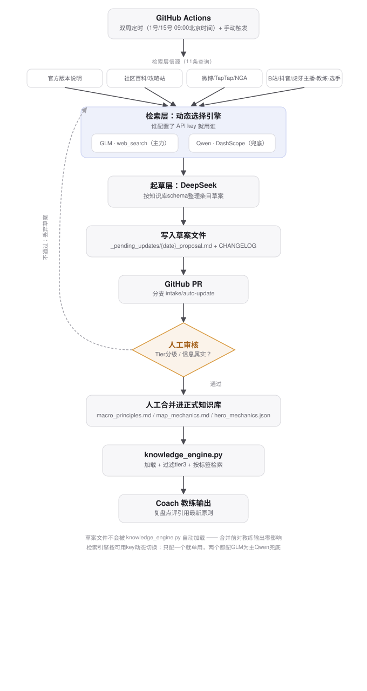

# 版本情报管线设计案例研究

*记录 `coach/intake/` 的问题背景、方案取舍与迭代过程，作为后续内容生产（开发日志、复盘文章、对外案例分享）的素材底本。*

*从GitHub Actions双周触发，到检索层动态选择GLM/Qwen引擎、DeepSeek起草，再到人工审核后合并进正式知识库、被 `knowledge_engine.py` 检索使用的完整闭环。草案文件在合并前对教练输出零影响。*

## 背景：知识库会过期

Coach 的决策建议全部依赖 `coach/knowledge_base/` 里的原则条目——防御塔机制、视野规则、越塔判断这些"基本功"知识，本质上是把教练/主播/官方专栏里分散的经验蒸馏成结构化、带信源、带版本号的条目，再由 `knowledge_engine.py` 按 death_type 检索、拼进复盘提示词。这套设计在冷启动阶段是成立的：条目是人工从VOD、专栏文章里精读整理出来的，质量有保障。

但王者荣耀是一个持续运营的游戏，赛季更新、英雄重做、机制调整的频率远高于人工精读整理知识库的频率。如果知识库不更新，教练给出的"越塔强杀轮流引仇恨"这类建议会在某次防御塔机制改版后变成过时甚至错误的指导——而这种错误是隐蔽的，教练不会自己意识到自己在用旧版本知识说话。用户提出的需求很直接：至少每两周巡检一次版本/攻略动态，把变化反映进知识库。

## 约束条件

在动手写代码之前，几个约束决定了整个方案的形状：

**信源几乎全在中文互联网，且分散在不同性质的平台。** 官方版本说明、社区攻略站、微博/TapTap/NGA的玩家反馈、B站/抖音/虎牙上主播和职业选手的解说，这四类信源的可信度天差地别——官方说明是事实，主播解说可能是个人风格化经验甚至错误理解。这直接呼应了知识库已有的 tier 分级硬规则（tier 3 风格化内容禁止进 `macro_principles.md`），情报管线必须延续这条规则，而不是绕开它。

**知识库错误的代价不对称。** 漏掉一条更新，教练只是暂时给出稍微过时的建议；但如果管线把一条可信度不足或理解错误的内容自动写进正式知识库，会直接污染所有后续的复盘建议，且很难被发现。这个不对称性是"起草-人工审核-合并"三段式流程的根本原因，而不是单纯的保守主义。

**模型选型要考虑对中文网络的实际访问能力。** 用户明确要求用 DeepSeek 和 GLM（智谱），原因也是这两家（以及后来加入的通义千问）对中文站点的搜索/访问能力是目前主流海外模型不具备的。

## 核心设计决策

### 1. 把"检索"和"起草"拆成两个独立阶段，而不是一个模型端到端做完

`intake/glm_search.py`（检索）和 `intake/draft_client.py`（起草，实为对 `core/llm_client.py` 的复用）是两个职责单一的模块。检索层的任务只是"去中文网络上把最近的动态找出来"，起草层的任务只是"把找到的原始材料整理成符合知识库schema的条目"。

这样拆分不是过度设计，而是因为两个任务对模型能力的要求本质不同：检索需要的是联网能力（GLM 的 `web_search` 插件、Qwen 的 `enable_search`），起草需要的是严格遵循复杂格式规则、克制不编造内容的指令遵循能力（DeepSeek）。合并成一次调用会让 prompt 同时承担"帮我搜索"和"帮我照着十几条规则写结构化条目"两个负担，起草规则（tier分级、禁止编造、去重、未实锤标注)本身就已经很重了，值得单独拿出来对话。

### 2. 检索引擎按"谁配了key就用谁"动态选择，而不是硬编码依赖顺序

管线最初只接入了 GLM。后来因为智谱key申请流程比预期慢，而项目已经有一个用于视觉模型（qwen-vl-plus）的 DashScope key，于是加入了 `intake/qwen_search.py` 作为第二个检索后端，见 `_pick_search_engines()`：两个key都配置了，GLM（结构化命中网页列表，信息更丰富）为主、Qwen兜底；只配置一个，那一个就是唯一引擎，没有备用；一个都没配，直接在启动时报错退出，不会带着空结果继续跑。

这个"看环境里有什么key就用什么"的设计，是为了让管线在密钥申请节奏不确定的真实情况下（比如"先有Qwen，智谱还在等审批"）依然能先跑起来，而不是被一个还没到位的密钥卡住整个上线时间表。之后补上智谱key也不需要改代码，自动切回"GLM主力"。`SearchResult.engine` 字段记录实际是哪个引擎查到的结果，草案里会如实标注，不会把兜底结果冒充成主引擎结果——这也是为了让人工审核时能判断某条信息的可信度基准线。

### 3. 起草结果永远不直接写正式知识库文件

这是整条管线里最刻意的一个决定。`run_intake.py` 只会把草案写进 `knowledge_base/_pending_updates/{date}_proposal.md`，绝不触碰 `macro_principles.md`、`map_mechanics.md`、`hero_mechanics.json`。更进一步，这个"安全"不是靠流程约定，而是靠代码结构本身保证的：`knowledge_engine.py` 的 `load_all_principles()` 只读取上一级目录那三个正式文件，`_pending_updates/` 目录从设计上就不在它的扫描范围内。也就是说，即使某次运行把明显错误的内容写进了草案文件，在人工合并之前，教练的实际输出不会受到任何影响。这比"训练大家养成审核习惯"可靠得多——错误的草案顶多是占用了一次人工审核的时间，不会污染下游。

配套地，GitHub Actions workflow 用 `peter-evans/create-pull-request` 把每次运行的草案开成一个PR（分支 `intake/auto-update`），`add-paths` 限定只包含 `_pending_updates/` 下的文件，进一步保证自动化流程物理上没有能力修改正式知识库——就算workflow配置或权限出了问题，能造成的最大影响也只是"开了一个奇怪的PR"，而不是"悄悄改坏了知识库"。

### 4. 起草prompt里把知识库的硬规则原样搬进去，而不是简化

`DRAFT_SYSTEM_PROMPT` 几乎是把 `macro_principles.md` 文件头的条目格式和知识引擎的tier规则完整复制了一份给DeepSeek，包括"tier 3 仍然可以起草，但要标注不能进正式文件"这种细节。这看起来啰嗦，但知识库的格式和分级规则本身就是整个RAG检索能替代向量库的前提（`knowledge_engine.py` 的注释里写得很清楚：v1.0规模靠标签+关键词匹配，不引入embedding）。如果起草层产出的草案格式跟人工撰写的条目对不上，人工合并环节的复制粘贴成本会显著增加，这条管线存在的意义（省人工）就打了折扣。

### 5. 双周调度用"每月1号/15号"近似，而不是纠结精确的14天间隔

标准cron语法不支持"每隔14天"这种间隔语义，只能表达日历日期。方案选择用 `0 1 1,15 * *`（UTC，对应北京时间09:00）在每月1号和15号各跑一次，实际间隔在13-16天之间浮动。这是一个明确记录在workflow注释里的近似，而不是silently假装精确——考虑到版本更新本身也不是严格按14天节奏发生的，这个近似的代价可以忽略，比自己维护一个基准日期+间隔天数的调度逻辑要简单可靠得多。`workflow_dispatch` 手动触发是配套加上的调试出口，避免每次改代码都要等到下一个整点日期才能验证效果。

### 6. 本地密钥加载后补的一层便利，不改变安全边界

最早版本要求本地跑管线前手动 `export` 三个环境变量。后来加入了 `load_local_secrets()`：如果项目根目录有 `secrets.local.txt`（已加入 `.gitignore`，不会被提交），启动时自动把其中的 `KEY=VALUE` 注入环境变量，且用 `setdefault` 不覆盖已经手动export过的值。这纯粹是本地开发体验的优化——GitHub Actions 那条路径完全不受影响，密钥依然通过repo secrets注入，两条路径互不干扰。

## 失败模式怎么处理

管线里几处"失败了怎么办"的选择，回顾起来都遵循同一个原则：**宁可少做，不可做错。**

单条查询失败（无论是GLM报错还是返回空结果），会尝试兜底引擎，两边都失败就跳过这一条，不会用空内容拼凑材料喂给起草层。全部11条查询都失败，管线直接以非零退出码中止，不生成任何草案文件——避免"没检索到东西"被误判成"这两周版本没有任何变化"这种更危险的沉默失败。起草层就算没找到任何值得收录的内容，也必须显式输出"本次巡检未发现需要收录的变化"这一行，而不是返回空文件，这样CHANGELOG和PR本身就是"管线确实跑过、确实没发现东西"的证据，用户不会误以为定时任务没触发。

## 这份文档可以喂养的后续内容

这条管线本身，连同它逐步演进的过程（先接入GLM → 补Qwen兜底 → 补本地密钥加载），是一个还算完整的"从0到1构建可信AI数据管线"的素材：可以拆成一篇"给游戏类知识库做版本情报自动化"的开发笔记，也可以在讨论"如何让AI应用的知识库保持新鲜度"这类话题时作为具体案例。`_pending_updates/CHANGELOG.md` 长期运行后会自然沉淀出一份"王者荣耀版本变化时间线"，这本身也是可以整理成对外内容（比如"S43赛季都改了什么"这类复盘）的原始素材，不需要额外调研。
